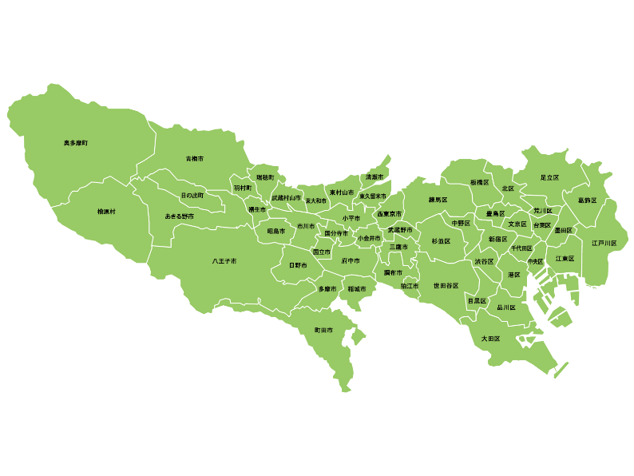
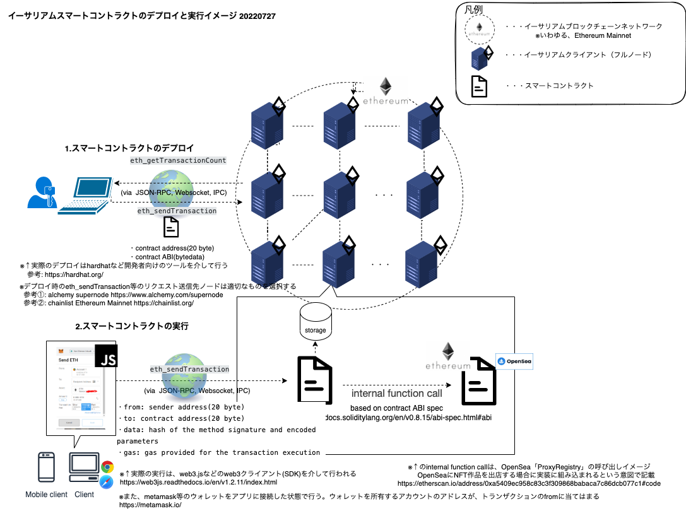

# awesome-1st-contract

## やりたいこと

- 「都道府県NFT」を作り出すスマートコントラクトを開発する
  - ダミーの「都道府県画像」を関連付けたNFTアート
    - 都道府県画像は以下の東京都の画像とする
      - 

- スマートコントラクトはイーサリアムのERC721に準拠する
  - [ERC-721 NON-FUNGIBLE TOKEN STANDARD](https://eips.ethereum.org/EIPS/eip-721)

## アーキテクチャ構成

`イーサリアムのスマートコントラクトのざっくりアーキテクチャ図。デプロイ(1)と実行(2)イメージを記載しています`

[](https://app.diagrams.net/#G12iTgUSfFQxdgGMREiKIBD__cfnmEz6Gh)

-  関連サイト
  - [ethereum.org - JSON-RPC API description](https://ethereum.org/en/developers/docs/apis/json-rpc/)
  - [alchemy supernode](https://www.alchemy.com/supernode)
  - [chainlist.org - Ethereum Mainnet](https://chainlist.org/)
  - [hardhat](https://hardhat.org/)
  - [web3.js](https://web3js.readthedocs.io/en/v1.2.11/index.html)
  - [metamask.io - crypto wallet and gateway to blockchain apps](https://metamask.io/)
  - [opensea.io - discover collect and sell extra ordinary NFTs](https://opensea.io/)
  - [etherscan.io - OpenSea's Smart Contract - ProxyRegistry](https://etherscan.io/address/0xa5409ec958c83c3f309868babaca7c86dcb077c1#code)

## 設計

- ERC721に準拠した場合に設計・実装が必要な関数
  - name関数, symbol関数, tokenURI関数は、ERC721で「metadata extension」として任意実装の扱い(OPTIONAL)とされているが,ここでは設計・実装の対象とする

|コントラクト|関数|説明|
|:-------:|:-------:|:-------:|
|JapanPrefectureNft|balanceOf|指定したアドレス（オーナー）が所有するNFTの数を返す|
||ownerOf|指定したトークン(NFT)のオーナーのアドレスを返す|
||safeTransferFrom|トークン(NFT)をfrom->toに安全に転送する|
||transferFrom|トークン(NFT)をfrom->toに転送する|
||approve|_approvedアドレスのユーザへのトークン_tokenIdの受け渡しを承認する|
||setApprovalForAll|_operatorアドレスをもつアカウントに全てのアセット管理を許可する|
||getApproved|トークン_tokenIdの承認済みイーサリアムアドレスを返却する|
||isApprovedForAll|オーナー_ownerから_operatorアドレスを持つユーザを承認済か否かを確認する|
||name|このスマートコントラクトが定義するNFTの名前を返却する(シンプルでわかりやすい名前を返却する)|
||symbol|このスマートコントラクトが定義するNFTのティッカーシンボルを返却する|
||tokenURI|指定したトークン(NFT)のURIを返却する（URIは個別のトークン(NFT)ごとに異なる値が割り当てられることが必須）|

- ERC721が定義する以下のイベントも、規格に準拠して、それぞれ対応する関数内で規格に準拠した適切なタイミングで呼び出す。
  - Transfer
      - `event Transfer(address indexed _from, address indexed _to, uint256 indexed _tokenId);`
      - emits when NFTs are created (`from` == 0) and destroyed (`to` == 0). Exception: during contract creation, any number of NFTs may be created and assigned without emitting Transfer. At the time of any transfer, the approved address for that NFT (if any) is reset to none.

  - Approval
      - `event Approval(address indexed _owner, address indexed _approved, uint256 indexed _tokenId);`
      - emits when the approved address for an NFT is changed or reaffirmed.
          - The zero address indicates there is no approved address.　When a Transfer event emits, this also indicates that the approved address for that NFT (if any) is reset to none.

  - ApprovalForAll
      - `event ApprovalForAll(address indexed _owner, address indexed _operator, bool _approved);`
      - emits when an operator is enabled or disabled for an owner.
          - The operator can manage all NFTs of the owner.


## 検討課題

- ERC721で実際どう実装すればいいのか、いまいち整理がついてない。
  - 参考にする
    - https://ethereum.org/en/developers/docs/standards/tokens/erc-721/
    - https://ethereumnavi.com/2021/11/09/contract-study-2-solidity-erc721/

  - safeTransferFromとtransferFromの違い is 何
  　- OpenZeppelinのコードを読んだ
      - safeTransferFromの方は
        - 転送先がコントラクト、かつ、トークンIERC721Receverインターフェースを実装してるコントラクトの場合
          - トークンの転送を受理するか検査できる（拒否することもできる） →GOXってヤツ
            - onERC721Receivedという関数を実装し、トークン転送を受理するか検査
              - この関数は、「function selector」を返す必要があるという仕様
                - [function selectorとは](https://ethereum.stackexchange.com/questions/72363/what-is-a-function-selector)
                - [function selectorとは2](https://y-nakajo.hatenablog.com/entry/2018/09/16/154612#Function-Selector)
                  - function selector allows you to perform dynamic invocation of a function
                  - 外部から関数を呼び出すときに、関数の実態を探し出し実行する処理のこと
                  - Function Selectorはコンパイル後に生成されるopcodesの先頭に近い位置に配置されます
                  - 関数呼び出し時のコールデータの最初の4バイトは呼び出す関数を指定しています。関数シグネチャにおけるKeccak-256(SHA-3)ハッシュの最初の4バイト(左から4バイトでビッグ・エンディアンの順序になっています)のことです
                    - [solidity calldataとは](https://ethereum.stackexchange.com/questions/52989/what-is-calldata)
                      - 関数の外部呼び出し、データがどこにストアされるか
                        - Functions can be called internally, e.g. from within the contract, or externally. When a function's visibility is external, only external contracts can call that function.
                          - When such an external call happens, the data of that call is stored in calldata.
                      - read-only byte-addressable space アドレシング可能
                        - 読み取り専用のバイトアドレシング可能空間
  - approveとsetApprovalForAllの違い
    - 「setApprovalForAllにより譲渡の許可がされているのであれば」「マーケットコントラクト上で煩わしいapproveは不要」という関係があると、Qiitaで説明を見かけたが、これは本当か?
      - https://qiita.com/rmanzoku/items/a90f265ae499dc21b9cb
    - ERC721の記載では、「approve」関数を実行するために「isApprovedForAll」による委譲をうけているオペレータであるかオーナーであることが必要という前提の記載があった
      - しかし、setApprovalForAllで許可がされていれば、approveが必要ないというルールは正しいのか?

- スマートコントラクトを作成したとき、NFTのトークンはどこにどんな状態？それはだれがきめるのか(ERC721がきめるのか?)
  - たぶん、自分で設計するやつ。
  - おそらく、スマートコントラクト作成時点では、まったくNFTトークンが発行されてない状態になると思う(コントラクト作成トランザクションを実行し、承認されない限りミント=鋳造してストレージに書き込むこともできないはず)
    - ではいつ　NFTを発行するのか？そして、無限に発行するわけではないと思うがどのように制御するのか?
      - この辺↓参考になるソースコードを探してみる
      - いつ、NFTは作成されるのか
        - 必要数分ミントして自分(もしくはそのスマコンアドレス)に紐付けて、自分(もしくはスマコン)が所有してる状態にする？
        - そして、フロントエンドのアプリからJSON-RPC経由で転送を依頼する?
        - 特定の条件を満たした場合だけ転送を承認する?
        - 作成とは、鋳造のことか？
      - 無限に作成できるのか?
        - 無限発行はまずいと思う。というか、それを制御するロジックを設計する必要があるはず。どう有限化するか

- とりあえず、サンプルに沿って「mintNFT」関数を実装した。これでNFTの発行ができそうだが、他にどのようなイベントが必要？
  - この辺、自由に実装するやつか?

## 備考: 拡張機能インストール

- JuanBlanco.solidity v0.0.139

## 備考: パッケージインストール

```
npm install --save-dev hardhat
```

```
npm install @openzeppelin/contracts
```

